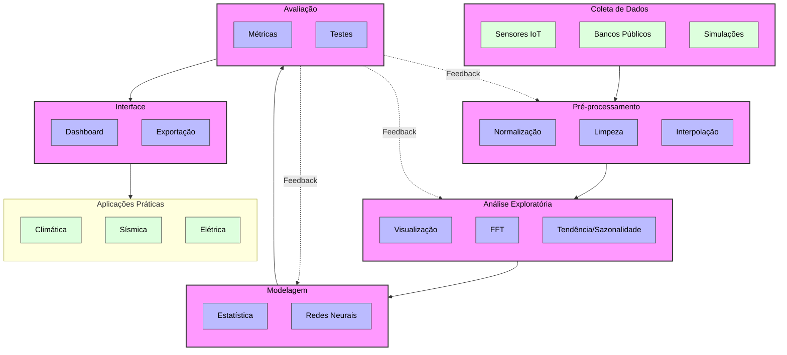
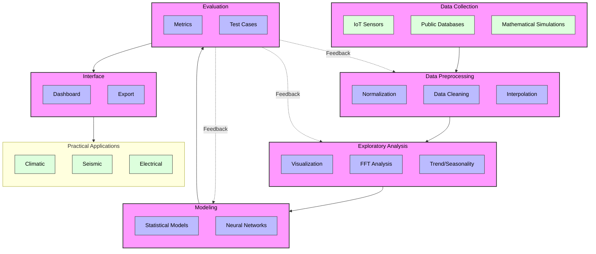

<meta charset="UTF-8">
<meta name="viewport" content="width=device-width, initial-scale=1.0">
<title>Diagrama Estilizado</title>

    

        <h1 style="color: #2c3e50; text-align: center; margin-bottom: 40px; font-size: 2.5em;">Diagrama em pt-br</h1>

  

  <h2>Explicação do Diagrama</h2>
  <ul>
        <li>As caixas rosadas representam os módulos principais do projeto</li>
        <li>As caixas azuis mostram os subprocessos dentro de cada módulo</li>
        <li>As caixas verdes indicam tecnologias e ferramentas utilizadas</li>
        <li>As linhas sólidas mostram o fluxo principal de dados</li>
        <li>As linhas pontilhadas representam loops de feedback</li>
  </ul>
      

  

      

        <h1 style="color: #2c3e50; text-align: center; margin-bottom: 40px; font-size: 2.5em;">Diagram in us-en</h1>

  

              <h2>Explanation</h2>
            <ul>
                <li>Pink boxes represent the main modules of the project</li>
                <li>Blue boxes show subprocesses within each module</li>
                <li>Green boxes indicate technologies and tools used</li>
                <li>Solid lines show the primary data flow</li>
                <li>Dotted lines represent feedback loops</li>
            </ul>
  

